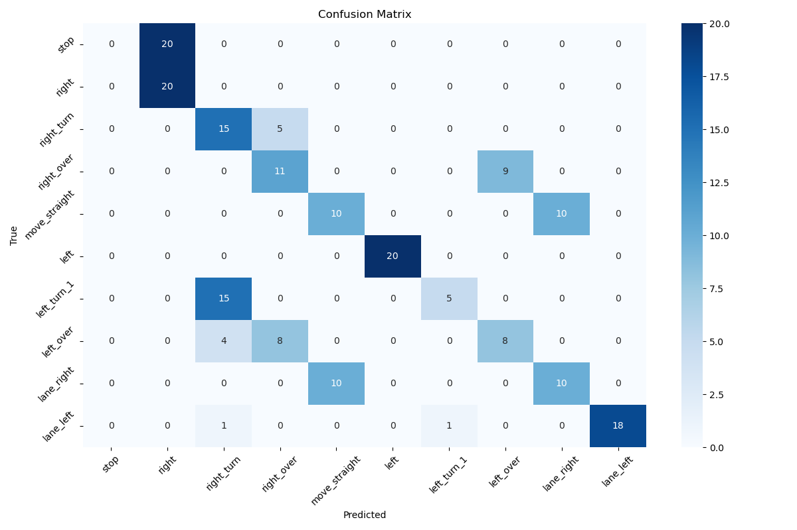
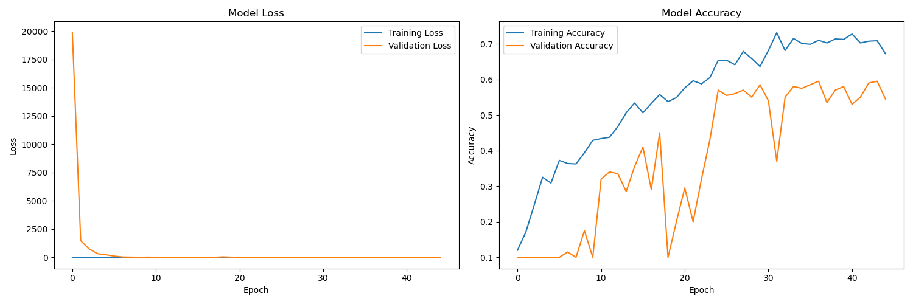
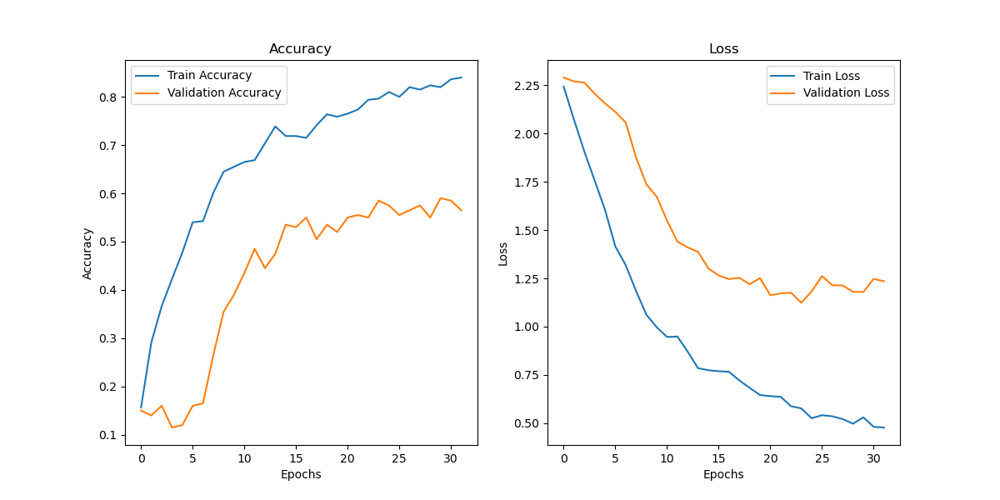
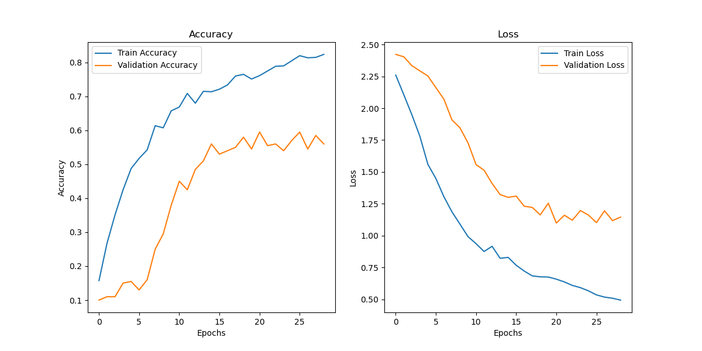
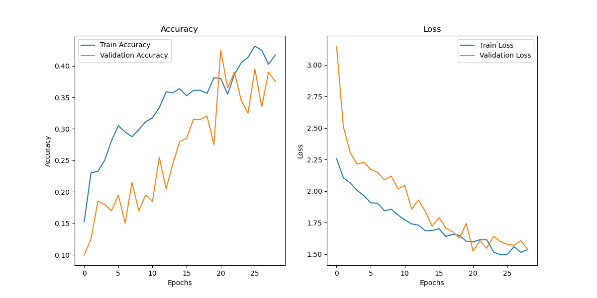
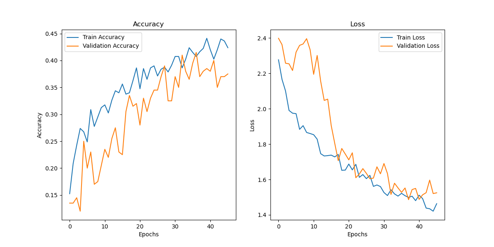

# Traffic Police Gesture Recognition with Enhanced Pose Processing (Convolution Pose Machine)

## Overview
This project focuses on recognizing traffic police gestures using pose estimation techniques. A Convolution Pose Machine (CPM)-inspired architecture is implemented to enhance gesture recognition performance. The project also compares CPM-based models with vanilla architectures like VGG16 and ResNet50 to evaluate performance differences.

## Results

### Vanilla VGG16
- **4 Layers Trained**  
  - Training Accuracy: **87%**  
  - Test Accuracy: **60%**
- **8 Layers Trained**  
  - Training Accuracy: **82%**  
  - Test Accuracy: **51%**

### Vanilla ResNet50
- **4 Layers Trained**  
  - Training Accuracy: **41%**  
  - Test Accuracy: **37%**
- **8 Layers Trained**  
  - Training Accuracy: **45%**  
  - Test Accuracy: **37%**

### CPM-Inspired VGG16
- **Training Accuracy**: **67.6%**  
- **Test Accuracy**: **58.5%**  
- **Advantages**: Improved generalization and reduced overfitting compared to vanilla architectures.

## Key Insights
1. Vanilla VGG16 achieves better accuracy compared to ResNet50 for traffic gesture recognition.
2. CPM-inspired VGG16 effectively balances training and test accuracy, reducing overfitting while maintaining competitive performance.

## Visualizations
- **Confusion Matrix CPM-Inspired VGG16**: 
- **Training Graph CPM-Inspired VGG16**: 
- **Training Graph Vanila VGG16 4 Layer trained**: 
- **Training Graph Vanila VGG16 8 Layer trained**: 
- **Training Graph Vanila Resnet50 4 Layer trained**: 
- **Training Graph Vanila Resnet50 8 Layer trained**: 

